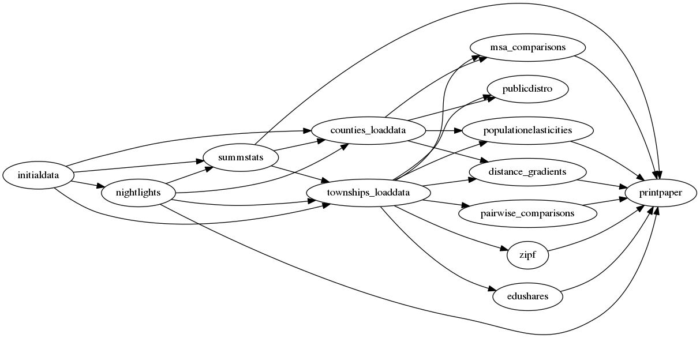

This repository contains the data and code underlying the paper "Cities, Lights, and Skills in Developing Economies" by Jonathan Dingel, Antonio Miscio, and Don Davis.

We thank Dylan Clarke for excellent research assistance, epecially for doing the yeoman's work of implementing our algorithms in `R` after they were initially written in `ArcGIS`.

## Code organization

The repository contains four top-level directories, one for each country: `brazil`, `china`, `india`, and `usa`.

The workflow for each country is organized as a series of tasks.
For example, the `china` directory contains 16 folders that represent 16 tasks.
Each task folder contains three folders: `input`, `code`, `output`.
A task's output is used as an input by one or more downstream tasks.
[This graph](china/symlinks_graph/output/task_flow.png) depicts the input-output relationships between tasks for `china`.

We use Unix's [`make`](http://swcarpentry.github.io/make-novice/) utility to automate this workflow.
After downloading this replication package (and installing the relevant software), you can reproduce the figures and tables appearing in the paper simply by typing `make` at the command line.

## Software requirements
The project's tasks are implemented via [R](https://cran.r-project.org/) code, [Stata](http://www.stata.com) code, and shell scripts.
The taskflow structure employs [symbolic links](https://en.wikipedia.org/wiki/Symbolic_link).
To run the code, you must have installed R, Stata, and Bash.
We ran our code using R 3.5.1, Stata 15, and GNU bash version 4.2.46(2).
Our R code leverages spatial and measurement packages with additional system requirements, namely [`gdalUtils`](https://cran.r-project.org/web/packages/gdalUtils/index.html), [`rgdal`](https://cran.r-project.org/web/packages/rgdal/index.html), [`rgeos`](https://cran.r-project.org/web/packages/rgeos/index.html), [`sp`](https://cran.r-project.org/web/packages/units/index.html), [`sf`](https://cran.r-project.org/web/packages/sf/index.html), and [`units`](https://cran.r-project.org/web/packages/units/index.html).
We used [GEOS](https://trac.osgeo.org/geos/) 3.7.0, [GDAL](https://www.gdal.org/usergroup0.html) 2.3.2, [PROJ](https://proj4.org/download.html) 4.9, and [udunits](https://www.unidata.ucar.edu/software/udunits/udunits-current/doc/udunits/udunits2.html) 2.2.
We expect the code to work on other versions too.

## Replication instructions

### Download and run code

1. Download (or clone) this repository by clicking the green `Clone or download` button above.
Uncompress the ZIP file into a working directory on your cluster or local machine.
2. From the Unix/Linux/MacOSX command line, navigate to a country directory.
3. Typing `make` in a country directory will execute all the code.
	* If you are in a computing environment that supports the [Slurm workload manager](https://slurm.schedmd.com/) (if the `Makefile` detects that the command `sbatch` is valid), tasks will be submitted as jobs to your computing cluster.
	* If `sbatch` is not available, the `Makefile` will execute `Rscript` and `state-se` commands locally.
	(Mac OS X users should [ensure](https://www.stata.com/support/faqs/mac/advanced-topics/) that `Rscript` and `state-se` are in their relevant `PATH`.)

### Notes
- It is best to replicate the project using the `make` approach described above.
Nonetheless, it is also possible to produce the results task-by-task in the order depicted in the flow chart for each country.
These are available in the `symlinks_graph/output` folder for each country (e.g., [China](china/symlinks_graph/output/graphviz.txt)).
If all upstream tasks have been completed, you can complete a task by navigating to the task's `code` directory and typing `make`.
- An internet connection is required so that each country directory's `install_packages` task can install R packages and Stata programs.
- The Brazil case requires gigabytes of microdata that is available from the [IBGE](http://www.ibge.gov.br).
Read the `CENSO10_pes_dta_metadata.txt` file in the `initialdata` folder within the `brazil` directory.
You can skip this step by running `skip_microdata.sh` within the `brazil` directory.
